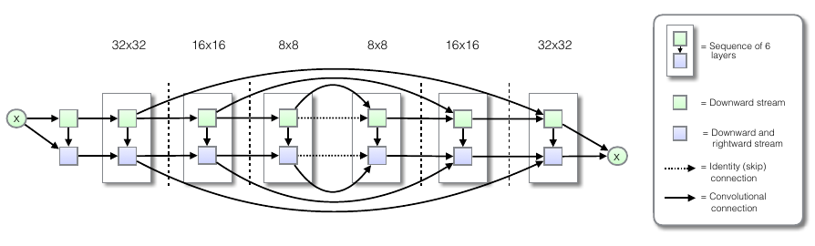

<!-- LaTeX preamble -->

```{=tex}
\newtheorem{theorem}{Theorem}

\newcommand{\E}{{\mathbb E}}
\newcommand{\Var}{\mathrm{Var}}
\newcommand{\se}{{\mathcal{E}}}
\newcommand{\R}{{\mathbb R}}
\renewcommand{\P}{{\mathbb P}}
\newcommand{\ac}{{\mathcal{A}}}
\newcommand{\A}{{\mathcal{A}}}
\newcommand{\B}{{\mathcal{B}}}
\newcommand{\T}{{\mathcal{T}}}
\newcommand{\Z}{{\mathcal{Z}}}
\newcommand{\K}{{\mathcal{K}}}
\newcommand{\lc}{{\mathcal{L}}}
\newcommand{\Ps}{{\mathcal{P}}}
\newcommand{\pa}{{\mathring{p}}}
\newcommand{\F}{{\cal F}}
\newcommand{\samp}{{\mathcal{X}}}
\newcommand{\X}{{\mathcal{X}}}
\newcommand{\hi}{{\hat{\Phi}}}
\newcommand{\indep}{\perp \!\!\! \perp}
\def\qt#1{\\qquad\\text{#1}}
\def\argmin{\mathop{\rm argmin}}
\def\argmax{\mathop{\rm argmax}}
```
{}

## Introduction

`TODO: - colors`

-   *We wish to model a complex dataset*

-   *NESF - destroy structure in the data distribution via a discrete forward diffusion*

-   *Introduce a tractable forward process (inference)*

-   ***Learn** the reverse diffusion process -\> generative model (entropy bounds)*

-   *Access to the full distributions: **exact sampling***

-   *Traditionally methods either inflexible (traditional stats), computationally expensive (MCMC), or non-analytical
    (boosted trees)*

-   *Theoretical underpinning: Langevin dynamics (can reach any smooth distribution* $\pi$)

Similar to Kalman filtering and smoothing, but without the observations $y$.

## General structure

`TODO: schematic`

### Forward diffusion

-   Start with the data and end with a isotropic Gaussian

General - a *Markov diffusion kernel* given a final state $\pi(x)$:

```{=tex}
\begin{equation}
    q(x_t | x_{t-1}) = T_\pi(x_t | x_{t-1}; \beta_t)
\end{equation}
```
Since it's a length one Markov process, we have for the full joint: \begin{equation}
    q(x_{t=0:T} ) = q(x_0) \prod_{i=1}^T q(x_i | x_{i-1})
\end{equation}

Usually, we use Gaussian diffusion for which the posterior is closed form (cf 1-step update in Kalman filtering):

```{=tex}
\begin{equation}
    q(x_t | x_{t-1}) = \mathcal{N}(\sqrt{1 - \beta_t}x_{t-1}, \beta_t \mathbf{I})
\end{equation}
```
Usually $\beta_1 < \beta_2 < ... < \beta_T$ - the **variance schedule**.

Moreover, due to the property of the Gaussian distribution:

$$\alpha_t := 1 - \beta_t$$

$$\bar{\alpha}_t := \prod_{s=1}^t \alpha_t$$

```{=tex}
\begin{equation}
q(x_t | x_0) = \mathcal{N}(\sqrt{\bar{\alpha_t}}~x_0, (1 - \alpha_t) \mathbf{I}),
\end{equation}
```
meaning any state in the forward process can be expressed knowing just the initial one and the variance schedule.

`TODO:`

### Reverse diffusion

-   *No closed form for* $q(x_{t-1}|x_t)$ in general
-   *Smoothing (needs the whole dataset) / Variational inference*
-   *But tractable* $q(x_{t-1}|x_t, x_0)$\
-   *ELBO - sum of closed form terms*\
-   *Train a NN to predict the mean*

A new transition probability $p(x)$

Starting point- stationary distribution:

```{=tex}
\begin{equation}
    \pi(x_T) := p(x_T)
\end{equation}
```
Like before:

```{=tex}
\begin{equation}
    p(x_{t=T:0}) = p(x_T) \prod_{i=T-1}^1 p(x_i+1 | x_{i})
\end{equation}
```
For Gaussian (and binomial), still the same family; however, we need to **learn** the parameters $\mu$ and $\Sigma$ via
a neural network.

This gives us the likelihood of the original data $p(x_0)$ from marginalizing the full joint: \begin{equation}
    p(x_0) = \int_{\mathcal{X}} p(x_{t=T:0}) ~ dx_1 .... dx_T
\end{equation}

Intractable! Use annealed importance sampling - comparing the relative probability of the backward - $p$ - and the
forward trajectories $q$:

```{=tex}
\begin{equation}
    p(x_0) = \int_{\mathcal{X}} q(x_{t=1:T}) ~p(x_T)~ \prod_{t=1}^T \frac{p(x_{t-1}|x_t)}{q(x_{t}|x_{t-1})} ~ dx_1 .... dx_T
\end{equation}
```
In the limit of very small $\beta$, both directions become the same.

## Training

We maximize the expected log likelihood of the original data $p(x_0)$ under the original true distribution $q(x_0)$:

```{=tex}
\begin{aligned}
    & L(p, q) = \mathbb{E}_{q(x_0)} [p(x_0)] = \int_{\mathcal{X}} q(x_0) ~ \log p(x_T)~ dx_0\\
    & = \mathbb{E}_{q} \left[ \underbrace{D( q(x_T | x_0) || p(x_T))}_{L_T} + \underbrace{\sum_{t=2}^T D( q(x_{t-1} | x_t, x_0) || p(x_{t-1} || x_t))}_{L_{t-1}} - \underbrace{\log p(x_0 | x+1)}_{L_0}   \right]
\end{aligned}
```
The corresponding log-likelihood can be *lower bounded* by a closed-form expression:

```{=tex}
\begin{aligned}
    L \geq K = - \sum_{t=2}^T \int q(x_0, x_t) ~ D(q(x_{t-1}|x_{t}, x_{0}) ~||~ p(x_{t-1}|x_{t}))~dx_0,~dx_t\\ 
    + H_q(X_T|X_0) - H_q(X_1|X_0) - H_p(X_T),&
\end{aligned}
```
where $D$ is the K-L divergence and H denotes the (conditional) entropies. Hence maximizing the latter maximizes the
former.

Additionally, conditioning the forward process posteriors on $x_0$ gives us the closed-forms

```{=tex}
\begin{equation}
q(x\_{t-1}\|x\_{t}, x\_{0}) = \mathcal{N}(\tilde{\mu}_t, \tilde{\beta}_t \mathbf{I})
\end{equation}
```
$$\tilde{\mu}_t := \frac{\sqrt{\bar{\alpha}_{t-1}} \beta_t}{1 - \bar{\alpha}_t}~x_0 + \frac{\sqrt{\bar{\alpha}_{t}} (1 - \bar{\alpha}_{t})}{1 - \bar{\alpha}_t}~x_t$$

$$\tilde{\beta}_t := \frac{1 - \bar{\alpha}_{t-1}}{1 - \bar{\alpha}_t} \beta_t$$

The goal of training is therefore to **estimate the reverse Markov transition densities** $p(x_{t-1}|x_t)$:
$$\hat{p}(x_{t-1}|x_t) = \underset{p}{\operatorname{argmax}} K$$

In the case of the Gaussian and binomial, the reverse process stays in the same family, therefore the task amounts to
estimating the parameters. This is done (in principle) by training a neural network for each $t$.

### Variance schedule

Since $\beta_t$ is a free parameter, it can be learned simultaneously with the whole $K$ optimization procedure,
freezing the other variables and optimizing on $\beta$.

Alternatively, the first paper also treated a sequence as a hyperparameter and used a simply linearly increasing
$\beta$. This is also the approach of *Ho et al.*

### Estimating $p$

The initial guesses are set to

$$
p(x_{t-1} | x_t) = \mathcal{N}(\mu(x_t, t), \Sigma(x_t, t)),
$$

where the parameters are what is to be estimated.

For the variance, it is simply set to be isotropic with the diagonal entries either fixed at a constant (either
$\beta_t$ or $\tilde{\beta}_t$) or learned. The latter proved to be unstable in Ho et al., but has since been
successfully implemented.

By inspecting the $L_{t-1}$ term in the likelihood in [Training], the minimizing mean can be expressed by the
reparametrization: $$x_t = \sqrt{\bar{\alpha}_t}~x_0 + \sqrt{1 - \bar{\alpha}_t}~\epsilon $$
$$\epsilon \sim \mathcal{N}(0, \mathbf{I})$$

```{=tex}
\begin{equation}
\mu(x_t, t) = \frac{1}{\sqrt{\alpha_t}} (x_t - \frac{\beta_t}{\sqrt{1 - \bar{\alpha_t}}} \epsilon_{\theta}(x_t, t)),
\end{equation}
```
where we learn the **noise** in the mean term at step $t$: $\epsilon_{\theta}(x_t, t))$ from the state $x_t$.

This can be further simplified by setting $t$ to be *continuous* on $[1, T]$ and optimizing the following simplified
objective for $\epsilon_\theta(x_t, t)$:

\begin{equation}
L_{\text{simple}}(\theta) := \mathbb{E}_{t, x_0, \epsilon} \left[\Vert \epsilon - \epsilon_\theta(\sqrt{\bar{\alpha}_t} x_0 + \sqrt{1 - \bar{\alpha}_t} \epsilon, t) \Vert^2\right]
\end{equation} This can be optimized using standard optimization techniques, such as gradient descent. We can now state
the two algorithms needed to first, train the noise estimator $\epsilon_\theta$, and then, obtain a sample from the
reverse diffusion process: {width="75%"}

### Architecture

Ho et al. used a variation of an U-net called [PixelCNN++](https://arxiv.org/abs/1701.05517) to estimate
$\epsilon_{\theta}(x_t, t))$:

{width="125%"}

<!-- ### Posteriors and marginals -->

<!-- `TODO:` -->

<!-- ## Conditional generation -->

<!-- `TODO:` -->

## How does it work in practice

### Original paper - recovery

{width="80%"}

### Ho et al - generation

The authors used the modified network for both **conditional** and **unconditional** generation.

The *unconditional generation* was performed by running estimating $x_0$ - the end result of the reverse process, from
initially random $x_T$. The following figure shows the order in which features crystallize when the *initial state is
itself sampled from various points of the reverse process*. The training dataset was CIFAR10.

{width="1500"}

For *conditional generation,* the authors selected a $x_t$ from the actual distribution and sampled from the predictive
posterior $p(x_0|x_t)$. The following figure shows the results conditioned on the bottom-right quadrant, for a network
trained on CelebA-HQ:

{width="1500"}

### Dall-E 2

[Ho and Salimans](https://arxiv.org/abs/2207.12598) improved the above procedure by introducing the notion of *guiding*
the model during training on labeled data, i.e. estimating $\epsilon_\theta(x_t, t ∣ y)$. This was used by Nichol
et al. in [GLIDE](https://arxiv.org/abs/2112.10741?s=09), which uses information extracted from text to do the guiding,
combining a transformer with the previously described architecture.

<!-- ## Applications in GANs -->

## References

-   The original paper: [Sohl-Dickstein et al. - Deep Unsupervised Learning using Nonequilibrium
    Thermodynamics](https://arxiv.org/abs/1503.03585)
-   Performant implementation: [Ho et al. - Denoising Diffusion Probabilistic Models](https://arxiv.org/abs/2006.11239)
-   A good blog post: [Weng, Lilian. (Jul 2021). What are diffusion models?
    Lil'Log.](https://lilianweng.github.io/posts/2021-07-11-diffusion-models/)
-   A summary of recent developments:
    <https://maciejdomagala.github.io/generative_models/2022/06/06/The-recent-rise-of-diffusion-based-models.html>
-   [The Kalman filter](https://en.wikipedia.org/wiki/Kalman_filter)
-   [My presentation on the Continuous-time Kalman
    filter](../../uploads/leban_andrej%20-%20continuous%20time%20kalman%20filter.pdf)
-   [Blei, Kucukelbir, McAuliffe - Variational Inference: A Review for Statisticians](https://arxiv.org/abs/1601.00670)
