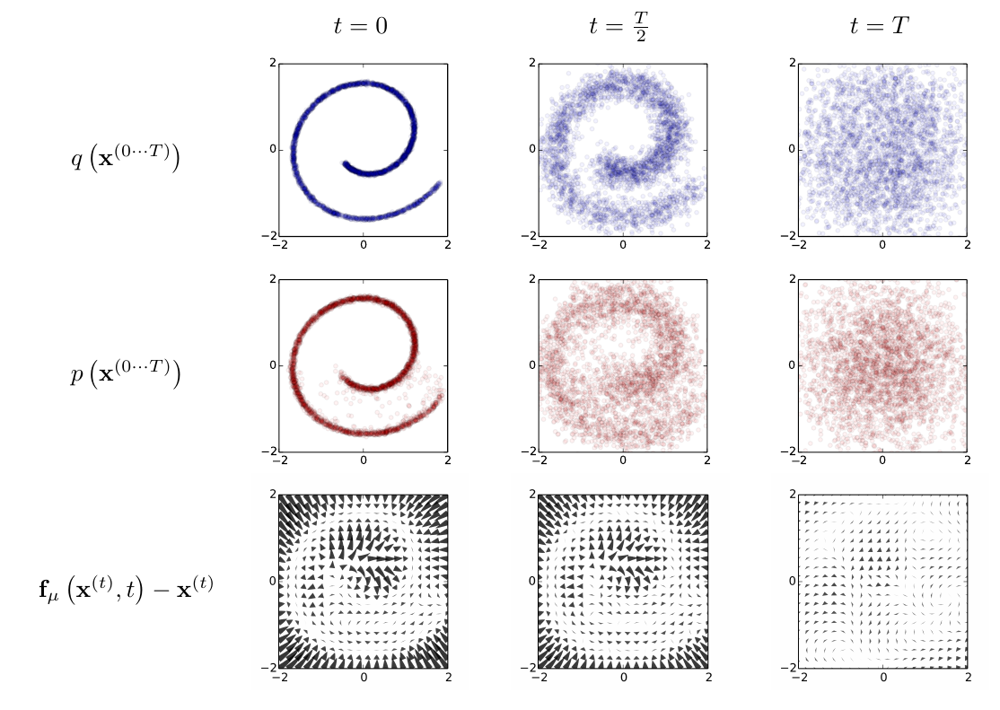

{}

## Introduction

- *We wish to model a complex dataset*
- *NESF - destroy structure in the data distribution via a *discrete* forward diffusion*
- *Introduce a tractable forward process (inference)*
- ***Learn** the reverse diffusion process -> generative model (entropy bounds)*
- *Access to the full distributions: **exact sampling***
- *Traditionally methods either inflexible (traditional stats), computationally expensive (MCMC), or non-analytical (boosted trees)*

- *Theoretical underpinning: Langevin dynamics (can reach any smooth distribution $\pi$)*

Similar to Kalman filtering and smoothing, but without the observations $y$.

## Forward and reverse diffusion

### Forward

- Start with the data and end with a isotropic Gaussian

General -  a *Markov diffusion kernel* given a final state $\pi(x)$:
\begin{equation}
    q(x_t | x_{t-1}) = T_\pi(x_t | x_{t-1}; \beta_t)
\end{equation}

Since it's a length one Markov process, we have for the full joint:
\begin{equation}
    q(x_{t=0:T} ) = q(x_0) \prod_{i=1}^T q(x_i | x_{i-1})
\end{equation}

Usually, we use Gaussian diffusion for which the posterior is closed form (cf 1-step update in Kalman filtering):

<!-- TODO: check with Kalman - for Kalman you have observations as well -->
\begin{equation}
    q(x_t | x_{t-1}) = \mathcal{N}(\sqrt{1 - \beta_t}x_{t-1}, \beta_t \mathbf{I})
\end{equation}

Usually $\beta_1 < \beta_2 < ... < \beta_T$

#### Stochastic gradient Langevin

### Reverse

- *No closed form for $q(x_{t-1}|x_t)$ in general*
- *Smoothing (needs the whole dataset) / Variational inference*
- *But tractable $q(x_{t-1}|x_t, x_0)$*  
- *ELBO - sum of closed form terms*  
- *Train a NN to predict the mean*  

A new transition probability $p(x)$

Starting point- stationary distribution:
\begin{equation}
    \pi(x_T) := p(x_T)
\end{equation}

Like before:
\begin{equation}
    p(x_{t=T:0}) = p(x_T) \prod_{i=T-1}^1 p(x_i+1 | x_{i})
\end{equation}

For Gaussian (and binomial), still the same family; however, we need to **learn** the parameters $\mu$ and $\Sigma$ via a
neural network.

This gives us the likelihood of the original data $p(x_0)$ from marginalizing the full joint:
\begin{equation}
    p(x_0) = \int_{\mathcal{X}} p(x_{t=T:0}) ~ dx_1 .... dx_T
\end{equation}

Intractable! Use annealed importance sampling - comparing the relative probability of the backward - $p$ - and the forward trajectories $q$:
\begin{equation}
    p(x_0) = \int_{\mathcal{X}} q(x_{t=1:T}) ~p(x_T)~ \prod_{t=1}^T \frac{p(x_{t-1}|x_t)}{q(x_{t}|x_{t-1})} ~ dx_1 .... dx_T
\end{equation}

In the limit of very small $\beta$, both directions become the same, hence we only need the forward trajectory $q(x_{t=1:T})$.

## Training

We maximize the expected log likelihood of the original data $p(x_0)$ under the original true distribution $q(x_0)$:
\begin{equation}
    L(p, q) = \mathbb{E}_{q(x_0)} [p(x_0)] = \int_{\mathcal{X}} q(x_0) ~ log(p(x_T))~ dx_0
\end{equation}

This can be *lower bounded* by a closed-form expression:
\begin{aligned}
    L \geq K = - \sum_{t=2}^T \int q(x_0, x_t) ~ D(q(x_{t-1}|x_{t-1}, x_{t}) ~||~ p(x_{t-1}|x_{t-1}, x_{t}))~dx_0,~dx_t\\ 
    + H_q(X_T|X_0) - H_q(X_1|X_0) - H_p(X_T)&
\end{aligned}

Where $D$ is the KL divergence and H denotes the (conditional) entropies. Hence maximizing the latter maximizes the former.

The goal of training is therefore to estimate the reverse Markov transition densities:
$$\hat{p}(x_{t-1}|x_t) = \underset{p}{\operatorname{argmax}} K$$
In the case of the Gaussian and binomial, the reverse process stays in the same family, therefore the task amounts to 
estimating the parameters.

### Variance schedule

Since $\beta_t$ is a free parameter, it can be learned simultaneously with the whole K optimization procedure,
freezing the other variables and optimizing on $\beta$.
Alternatively, the first paper also used a linearly increasing $\beta$.

- *simple linspace*
- *cosine based*

### Posteriors and marginals
`TODO:`

## Conditional generation

`TODO:`

## Examples

### Original paper

{width=80%}

## Applications in GANs

## References

 - The original paper: [Sohl-Dickstein et al. - Deep Unsupervised Learning using Nonequilibrium Thermodynamics](https://arxiv.org/abs/1503.03585)  
 - [Ho et al. - Denoising Diffusion Probabilistic Models](https://arxiv.org/abs/2006.11239)
 - A good blog post: [Weng, Lilian. (Jul 2021). What are diffusion models? Lil’Log.](https://lilianweng.github.io/posts/2021-07-11-diffusion-models/) 
 - [The Kalman filter](https://en.wikipedia.org/wiki/Kalman_filter)  
 - [My presentation on the Continuous-time Kalman filter](../../uploads/leban_andrej - continuous time kalman filter.pdf)  
 - [Blei, Kucukelbir, McAuliffe - Variational Inference: A Review for Statisticians](https://arxiv.org/abs/1601.00670)
 

